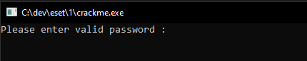

# ESET crackme writeup - Part 1

This post is a description of my solution to the [ESET crackme](https://join.eset.com/en/challenges/crack-me). It will cover the analysis and solution of the first file, that can be downloaded from the link above.

## Downloading and opening
When clicking the "DOWNLOAD THE CRACKME.EXE PROGRAM" button on the website, the file received is named crackme.zip. Since I couldn't open it as a zip archive, I analyzed it with a Hex Editor:

Apparently, this is simply a PE file. I changed its name to crackme.exe and executed it (within a VM, of course).

So far, so standard.

[Link back home](../README.md).
