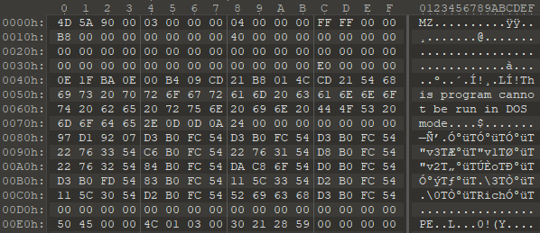
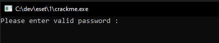
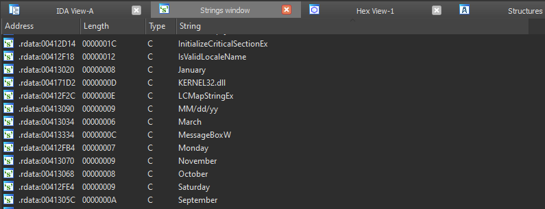
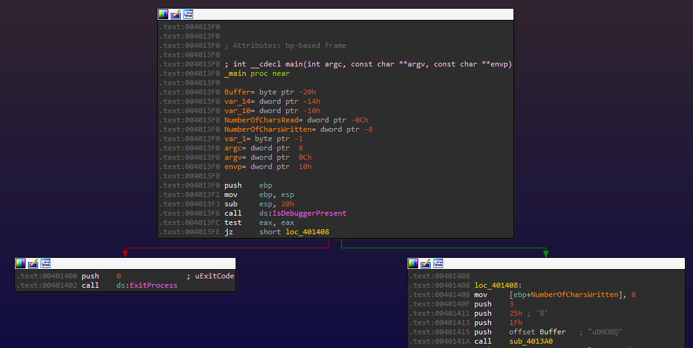

# ESET crackme writeup - Part 1

This post is a description of my solution to the [ESET crackme](https://join.eset.com/en/challenges/crack-me). It will cover the analysis and solution of the first file, that can be downloaded from the link above.

## Downloading and opening
When clicking the "DOWNLOAD THE CRACKME.EXE PROGRAM" button on the website, the file received is named crackme.zip. Since it doesn't open as a zip archive, I analyze it with a Hex Editor:

Apparently, this is simply a PE file. I'm not sure if this is part of the challenge or a simple way to circumvent Browser warnings about downloading an executable. I change its name to crackme.exe and execute it (within a VM, of course).

So far so standard.

## Initial Analysis

The next step would be opening the file within IDA and running it with a debugger. While I do have access to an IDA license, it does not include an x86 Decompiler, and thus the analysis will be done in assembly.
IDA recognizes the file as a standard PE and auto-analyzes it properly. Once it is done, I take a look at the Strings window and find nothing interesting at all. Specifically, the prompt displayed when running is not there:

The strings are probably obfuscated, then, and deobfuscated in runtime.

Let's have a look at the beginning of the main function:

There is a call to IsDebuggerPresent, which, if true, causes the program to close immediately. This is a very simple form of Anti-Debugging, as it can be circumvented with a breakpoint at 0x4013FC, where we change eax to be 0.

In WinDbg the command `bp 4013FC "r eax=0;g"` takes care of that.

## Deobfuscation 101

[Link back home](../README.md).
